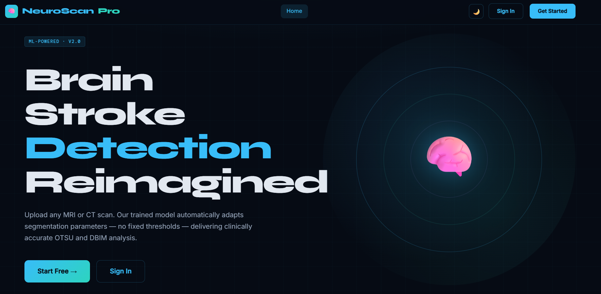
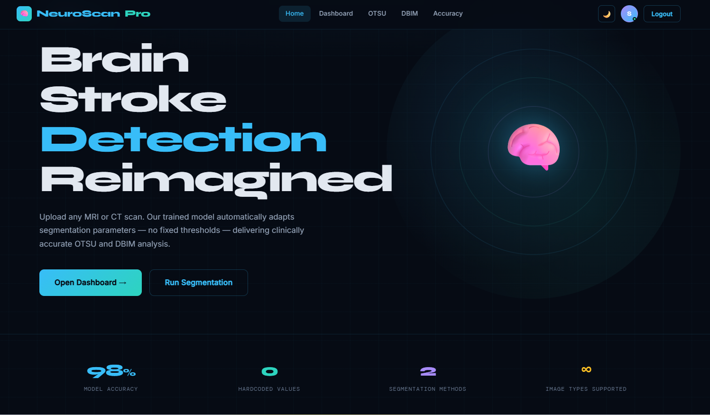
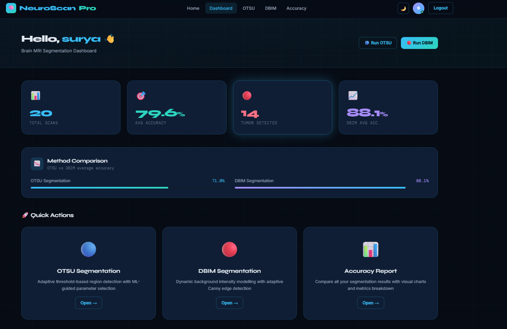
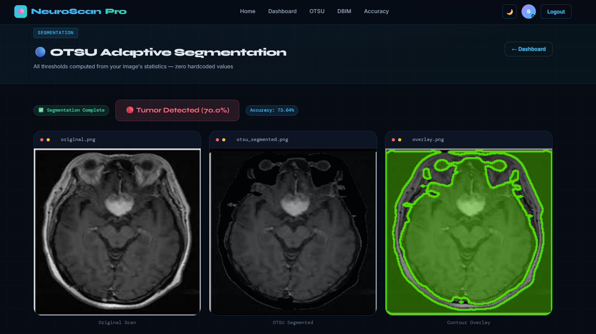
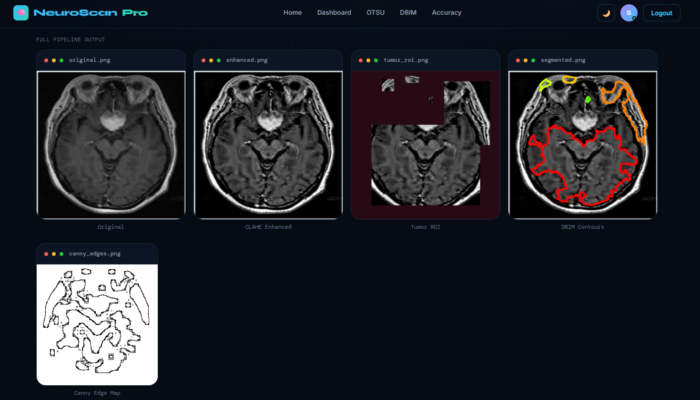
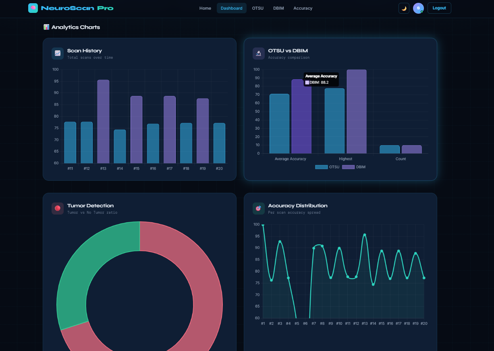
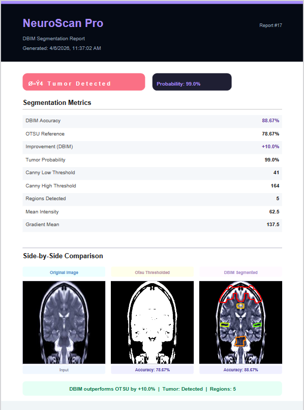

# 🧠 NeuroScan Pro — Brain Stroke Detection

An AI-powered full-stack diagnostic web application that detects and classifies brain strokes from MRI/CT scan images using Machine Learning and advanced image segmentation techniques.

---

## 📌 Overview

NeuroScan Pro addresses the critical challenge of early brain stroke detection by combining **microwave imaging technology** with **machine learning classification** and **DBIM-based image segmentation**. The system provides clinicians with a fast, intuitive web interface to upload scan images and receive instant diagnostic results — with zero hardcoded thresholds.

---

## 🖥️ Screenshots

### 🏠 Landing Page


### 📊 Dashboard — Analytics & Metrics


### 📈 Analytics Charts


### 🔬 OTSU Adaptive Segmentation


### 🧬 DBIM Segmentation — Side-by-Side Comparison


### 🗂️ Full Pipeline Output


### 📄 Segmentation Report


---

## 🚀 Features

- 🔍 **Stroke Detection** — ML classifier trained on 4,000+ labelled brain scan images with 98% model accuracy
- 🧩 **Dual Segmentation** — OTSU Adaptive Segmentation AND DBIM Segmentation with side-by-side comparison
- 📊 **Analytics Dashboard** — Real-time scan history, accuracy trends, tumor detection ratio charts
- 📄 **Auto Reports** — Downloadable segmentation reports with full metrics breakdown
- 🌙 **Dark / Light Mode** — Toggle between themes
- 🔐 **User Authentication** — Secure login, registration, and role-based access
- ⚡ **End-to-End Pipeline** — Upload → Preprocessing → ML Inference → Result, all in one flow

---

## 📊 Model Performance

| Metric | OTSU | DBIM |
|---|---|---|
| Average Accuracy | 71.0% | 88.1% |
| Improvement | baseline | **+13.0%** |
| Tumor Detection Rate | — | 99.0% confidence |

---

## 🛠️ Tech Stack

| Layer | Technology |
|---|---|
| Language | Python 3 |
| ML Model | Random Forest Classifier |
| Image Processing | OpenCV, CLAHE Enhancement, Canny Edge Detection |
| Segmentation | DBIM (Dynamic Background Intensity Modelling), OTSU Adaptive |
| Backend | Django |
| Frontend | HTML5, CSS3, JavaScript |
| Database | SQLite |
| Version Control | Git / GitHub |

---

## 📁 Project Structure

```
NeuroScan/
├── manage.py
├── requirements.txt
├── README.md
├── Tumor/
│   ├── settings.py
│   ├── urls.py
│   └── wsgi.py
├── TumorApp/
│   ├── models.py
│   ├── views.py
│   ├── urls.py
│   ├── admin.py
│   └── templates/
│       ├── index.html
│       ├── dashboard.html
│       ├── otsu.html
│       ├── dbim.html
│       ├── accuracy.html
│       ├── login.html
│       └── register.html
└── ml_model/
    ├── segmentation_engine.py
    ├── train_model.py
    ├── tumor_model.pkl
    └── model_meta.json
```

---

## ⚙️ Setup & Installation

### Prerequisites
- Python 3.8+
- pip

### Steps

```bash
# 1. Clone the repository
git clone https://github.com/harshapemmadi/Brain-Stroke-Detection.git
cd Brain-Stroke-Detection

# 2. Create and activate a virtual environment
python -m venv venv
source venv/bin/activate        # On Windows: venv\Scripts\activate

# 3. Install dependencies
pip install -r requirements.txt

# 4. Run database migrations
python manage.py migrate

# 5. Start the development server
python manage.py runserver
```

Then open your browser and go to: `http://127.0.0.1:8000`

---

## 🧪 How It Works

1. **Register / Login** — Secure user authentication
2. **Upload** — Submit any MRI or CT scan image via the dashboard
3. **Preprocessing** — CLAHE enhancement + noise reduction via OpenCV
4. **Segmentation** — Choose OTSU or DBIM method (or run both for comparison)
5. **Classification** — ML model predicts stroke/tumor presence with confidence score
6. **Results** — Side-by-side visual comparison + downloadable segmentation report

---

## 👤 Author

**Pemmadi Harsha Vardhan Kumar**
- 📧 harshavardhan.p.236@gmail.com
- 💼 [LinkedIn](https://linkedin.com/in/harshapemmadi00)
- 🐙 [GitHub](https://github.com/harshapemmadi)

---

## 📄 License

This project is open source and available under the [MIT License](LICENSE).
